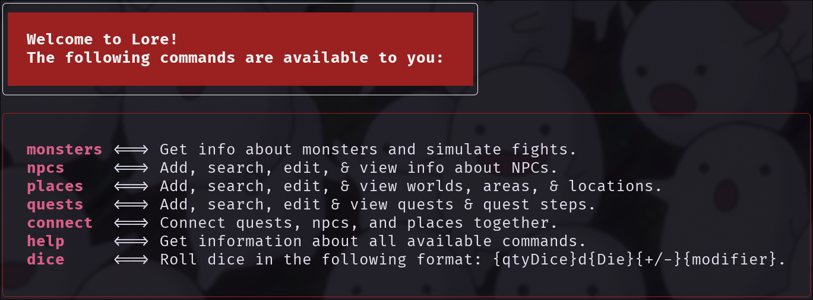

# Lore
A CLI tool for game masters running D&D, Pathfinder, and other tabletop game
campaigns. All written in Go. While I still largely run a pen & paper campaign,
I always keep a laptop up and running for looking up info and keeping notes.

Currently a work in progress, but still functional!



## Installing Lore

Prerequisites:
- Go
- SQLite3

Install the Go toolchain [via the docs](https://go.dev/doc/install) or [via webi](https://webinstall.dev/golang/)!

Install SQLite3 via your necessary method!

For example:
```bash
# Ubuntu
sudo apt update && sudo apt upgrade && sudo apt install sqlite3

# Arch
sudo pacman -Syu && sudo pacman -S sqlite:

# Mac
brew install sqlite3
```

Now simply install Lore via the Go toolchain:
```bash
go install github.com/jake-abed/lore
```

## Commands

### **help**
Lists all available commands

### **monsters**
- **-i <monster name or id>**    | Get basic information about a monster from the D&D 5e API.
- **-f <monster-1> <monster-2>** | Simulate a turn-based fight between two monsters.
- - Slightly skewed as it does not factor movement or flying into the battles, so extremely agile or flying monsters will have less of an edge than they normal would.

### **npcs**
View, search, edit, and create custom NPCs for your campaign.

- **-a**        | Add new NPC via form!
- **-v <name>** | View an NPC with the provided name (exact match).
- **-s <name>** | Lists all NPCs that partially match the provided name.
- **-e <name>** | Edit an NPC with the provided name (exact match).

### **places**
View, search, edit, and create custom places for your campaign.
- **<place-flag> -a**         | Add a new place via form!
- **<place-flag> -d** <id>    | Delete a place by ID represented as an integer.
- **<place-flag > -v <name>** | View a place with the provided name (exact match).
- **<place-flag> -s <name>**  | Lists all places that partially match the provided name.
- **<place-flag> -e <name>**  | Edit a place with the provided name (exact match).

#### Uses 'place flags' to mark which place type you are operating on.
- --world       | Overaching world for a campaign.
- --area        | Areas or regions of a world.
- --location    | Locations contained within areas.
- --sublocation | Not implemented! Not sure if necessary or overkill?

## Contributing

Want to contribute to Lore at all?

### Clone the repo:
```bash
git clone https://github.com/jake-abed/lore
cd lore
```

### Build it:
```bash
go build
```

### Submit a pull request!

If you want to contribute anything at all, please fork the repository
and open up a pull request to the 'main' branch.
